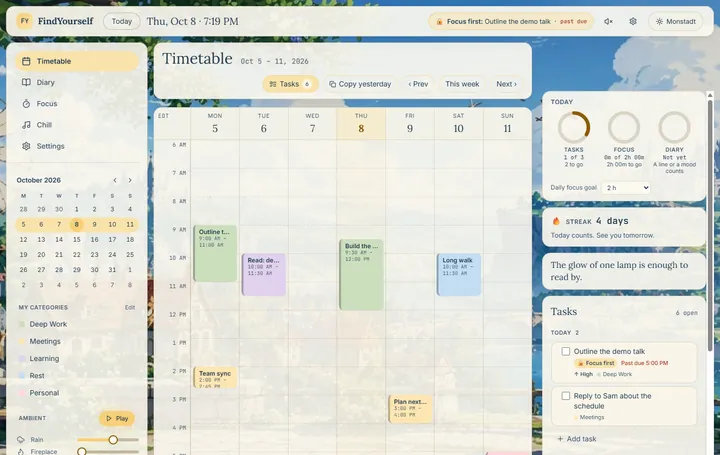
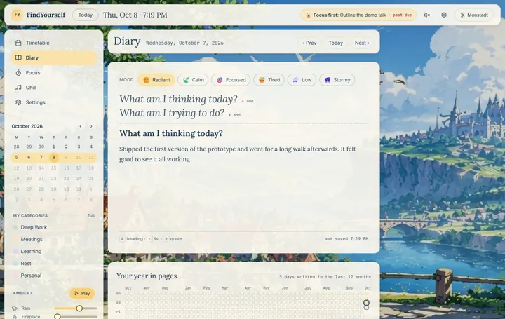
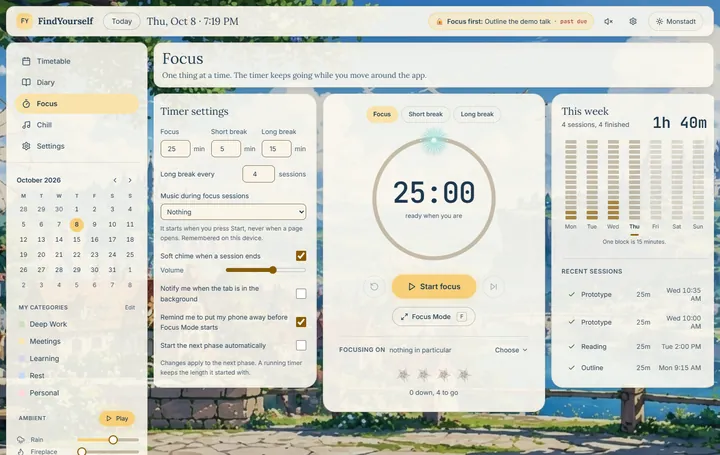
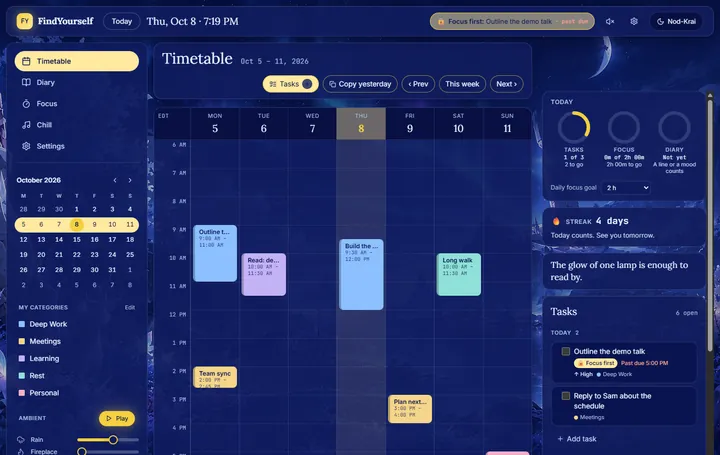
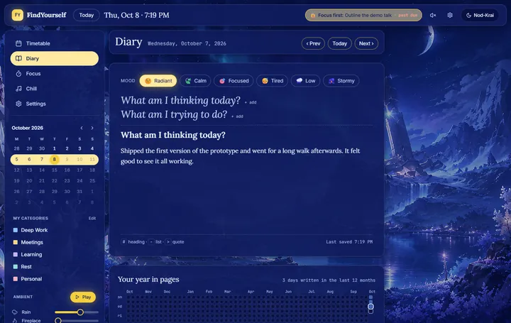
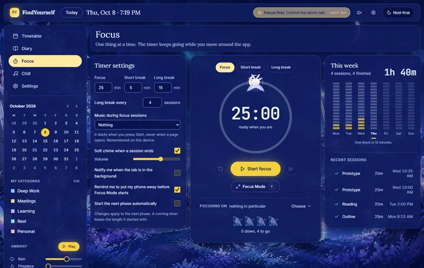

# FindYourself

> A cozy personal productivity sanctuary: plan your day, write your thoughts, and build a workspace that feels like *yours*.

**Live:** https://findyourself-mu.vercel.app (use **Try the demo** on the home page for a temporary account with sample data, no sign-up needed)

FindYourself is a full-stack web app that combines a Google Calendar-style **timetable**, a private **diary**, a **task manager with focus restrictions**, a **Pomodoro timer**, and a **custom ambient environment** (synthesized rain, fire, keyboard, cafe and piano, plus your own music) in one calm workspace. A painted scene sits behind every page: **Monstadt** by day (a bright meadow town by the water) and **Nod-Krai** at night (a frozen bay under an aurora). It follows your clock, or you pick one by hand.

It is a portfolio project that shows end-to-end product work: a written PRD, user stories, architecture and database design, a design system, and a deployed app with its database rules, tests and accessibility measured rather than assumed.

## Screenshots

Real captures from the demo account (day above, night below; the timetable, a diary page, the focus page):

| | | |
|---|---|---|
|  |  |  |
|  |  |  |

## What it does

| | |
|---|---|
| **Timetable** | A week grid: drag to create a block, drag to move or resize, colour-coded categories, "copy yesterday", a month calendar in the sidebar to jump to any week |
| **Tasks** | Today / Tomorrow / Backlog board (drag between buckets), priority, deadline, "Focus first" restrictions with a live countdown chip, an end-of-day roll |
| **Diary** | One page per day with a rich-text editor, mood, guiding prompts, autosave with an offline safety net, and a year heatmap |
| **Focus** | A round Pomodoro timer with a little spirit riding the ring (a dandelion seed by day, a moon-moth at night) and a flower for every finished session; it keeps running across pages. A dimmed Focus Mode over the live scene, a weekly focus tile, and music for focus sessions |
| **Chill** | The painted scene brought to life (wind, gusts, clouds or an aurora, seeds or snow, flowers that sway; still when you ask for less motion), full screen like a screensaver; a mixer of five synthesized ambient layers, your own MP3s with playlists and a mini-player that plays across pages, and community picks |
| **Motivation** | A streak computed by the database, a daily quote, progress rings, and a "your week" card on Sunday evening |
| **Appearance** | Day, Night or Auto (night from 18:00 to 06:00 in your time zone), and a region for each; the choice follows you to every device |
| **Account** | Categories you can rename, recolour and reorder; delete-account that removes everything, including your files |

## Things worth a closer look

- **The database is the security boundary.** Every table has row-level security; uploads are checked in the app, by the storage bucket and policies, and by a locking trigger; guest accounts are blocked from uploads and suggestions by the database; the streak cannot be written by the client. Each rule has a SQL test in [`supabase/tests/`](supabase/tests) that proves it by the *reason* it refuses.
- **The streak is computed, not trusted.** A trigger recomputes it from your own rows in your own time zone (a pure SQL function, tested), so un-completing a task or a back-dated entry can never leave a wrong number.
- **Accessibility is measured.** Lighthouse is run on every page at three screen shapes in both themes (`npm run lighthouse`; the scores are in [`docs/THEME_HANDOFF.md`](docs/THEME_HANDOFF.md)). Colour contrast is held to WCAG AA by tests that read the real theme tokens, composite every text colour over the *painting* it sits on (the glass panels, Focus Mode's veil), and every animation respects `prefers-reduced-motion`, also tested.
- **The theme is painted on the server.** Your choice and your clock decide it from cookies, so the first byte is already the right scene; a small head script corrects a first visit before paint. The inline script is tested by running it against the resolver at every half hour across daylight-saving changes.
- **Honest failure.** Error boundaries keep the music and timer alive when a page breaks; every action names why it refused; a test fails if the privacy page's list of cookies and device storage drifts from the code.
- **The guest demo is a per-visitor sandbox:** a temporary anonymous account seeded by a database function that runs *as* the visitor, deleted automatically after 24 hours.

## Tech stack

- **App:** Next.js 14 (App Router, server actions), TypeScript, Tailwind CSS
- **UI libraries:** Tiptap (editor), dnd-kit (drag and drop), zustand (client state), lucide-react (icons)
- **Audio:** the Web Audio API (the ambient layers are generated in the browser, no audio files)
- **Backend:** Supabase (Postgres with RLS, Auth including anonymous sign-ins, Storage, pg_cron)
- **Tests:** Vitest (870+ unit tests), SQL test files, Lighthouse
- **Deployment:** Vercel and Supabase

## Running it locally

```bash
npm install
cp .env.local.example .env.local   # fill in your Supabase URL and keys
npm run dev                         # http://localhost:3000
```

Database migrations are in [`supabase/migrations/`](supabase/migrations) (apply them to a Supabase project in order). The service-role key (`SUPABASE_SERVICE_ROLE_KEY`) is only needed for account deletion and must never be public.

```bash
npm run typecheck && npm run lint && npm test
npm run build && npx next start -p 3200   # then, in another terminal:
npm run lighthouse -- --base http://localhost:3200
```

## Documentation

- [Product Requirements](docs/PRD.md) and [User Stories](docs/USER_STORIES.md)
- [Architecture](docs/ARCHITECTURE.md), [Database Schema](docs/ERD.md) and [Design System](docs/DESIGN_SYSTEM.md)
- [Roadmap](docs/ROADMAP.md) and the [Decision Log](docs/DECISIONS.md), a dated record of what was built, how it was verified and what was left out

## Status

Phases 1-9 (the whole app) are built, and the design pass is done on the `design/stage2-themes` branch: the two painted themes, the Appearance settings, the round timer with its spirit, the living scenes and the landing page (see [`docs/THEME_HANDOFF.md`](docs/THEME_HANDOFF.md)). Still open: sharper wallpapers, the Liyue and Natlan regions, real wind recordings and image credits. Original art and sounds only (the scenes are game-inspired place names with original compositions); the app has no AI features. It was built by Minh with Claude (Anthropic) as a coding assistant.

## Author

Built by Minh Tran as a portfolio project: product design, engineering and deployment.
